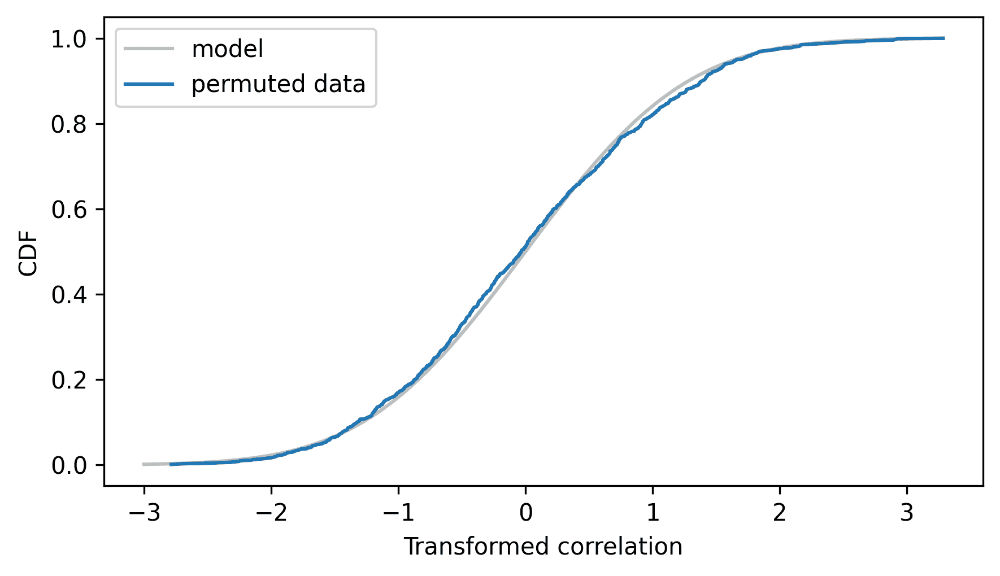

# 解析方法

> 原文：[`allendowney.github.io/ThinkStats/chap14.html`](https://allendowney.github.io/ThinkStats/chap14.html)

本书一直关注计算方法，如模拟和重采样，但我们解决的一些问题有解析解，这些解可以更快地计算。

本章介绍了一些这些方法，并解释了它们是如何工作的。在章节末尾，我提出了一些建议，关于如何将计算和分析方法整合到数据分析中。

[在此处运行此笔记本](https://colab.research.google.com/github/AllenDowney/ThinkStats/blob/v3/nb/chap14.ipynb)。

```py
from  os.path  import basename, exists

def  download(url):
    filename = basename(url)
    if not exists(filename):
        from  urllib.request  import urlretrieve

        local, _ = urlretrieve(url, filename)
        print("Downloaded " + local)

download("https://github.com/AllenDowney/ThinkStats/raw/v3/nb/thinkstats.py") 
```

```py
try:
    import  empiricaldist
except ImportError:
    %pip install empiricaldist 
```

```py
import  numpy  as  np
import  pandas  as  pd
import  matplotlib.pyplot  as  plt

from  thinkstats  import decorate 
```

## 正态概率图

许多解析方法基于正态分布的性质，原因有两个：现实世界中许多测量的分布很好地近似于正态分布，而且正态分布具有使它们对分析有用的数学性质。

为了证明第一个观点，我们将查看企鹅数据集中的某些测量值。然后我们将探索正态分布的数学特性。下载数据的说明在本书的笔记本中。

下一个单元格将从 Allison Horst 创建的存储库中下载数据。

Horst AM, Hill AP, Gorman KB (2020). palmerpenguins: 帕默群岛（南极）企鹅数据。R 包版本 0.1.0。[`allisonhorst.github.io/palmerpenguins/`](https://allisonhorst.github.io/palmerpenguins/). doi: 10.5281/zenodo.3960218.

数据是作为导致这篇论文的研究的一部分收集的：Gorman KB, Williams TD, Fraser WR (2014).南极企鹅（属 Pygoscelis）群落中的生态性两性差异和环境可变性。PLoS ONE 9(3):e90081。[`doi.org/10.1371/journal.pone.0090081`](https://doi.org/10.1371/journal.pone.0090081)

```py
download(
    "https://raw.githubusercontent.com/allisonhorst/palmerpenguins/c19a904462482430170bfe2c718775ddb7dbb885/inst/extdata/penguins_raw.csv"
) 
```

我们可以像这样读取数据。

```py
penguins = pd.read_csv("penguins_raw.csv")
penguins.shape 
```

```py
(344, 17) 
```

数据集包含三种企鹅物种的测量值。在这个例子中，我们将选择阿德利企鹅。

```py
adelie = penguins.query('Species.str.startswith("Adelie")').copy()
len(adelie) 
```

```py
152 
```

为了查看企鹅体重是否遵循正态分布，我们将计算数据的经验累积分布函数（CDF）。

```py
from  empiricaldist  import Cdf

weights = adelie["Body Mass (g)"].dropna()
cdf_weights = Cdf.from_seq(weights) 
```

我们将计算具有相同均值和标准差的正态分布的解析累积分布函数（CDF）。

```py
m, s = weights.mean(), weights.std()
m, s 
```

```py
(np.float64(3700.662251655629), np.float64(458.5661259101348)) 
```

```py
from  scipy.stats  import norm

dist = norm(m, s)
qs = np.linspace(m - 3.5 * s, m + 3.5 * s)
ps = dist.cdf(qs) 
```

这是数据与正态模型相比的累积分布函数（CDF）的样子。

```py
model_options = dict(color="gray", alpha=0.5, label="model")
plt.plot(qs, ps, **model_options)
cdf_weights.plot(label="data")

decorate(ylabel="CDF") 
```


正态分布可能足以作为这些数据的模型，但它肯定不是完美的拟合。

通常，绘制数据的累积分布函数（CDF）和模型的累积分布函数是一种评估模型拟合数据好坏的好方法。但这种方法的一个缺点是它依赖于我们对模型参数估计的好坏——在这个例子中，是均值和标准差。

另一个选择是**正态概率图**，它不依赖于我们估计参数的能力。在正态概率图中，\(y\)值是排序后的测量值。

```py
ys = np.sort(weights) 
```

而\(x\)值是正态分布的相应百分位数，使用`norm`对象的`ppf`方法计算，该方法计算“百分位数函数”，即逆 CDF。

```py
n = len(weights)
ps = (np.arange(n) + 0.5) / n
xs = norm.ppf(ps) 
```

如果测量值实际上是从正态分布中抽取的，那么\(y\)和\(x\)值应该落在一条直线上。为了看看它们做得如何，我们可以使用`linregress`来拟合一条线。

```py
from  scipy.stats  import linregress

results = linregress(xs, ys)
intercept, slope = results.intercept, results.slope

fit_xs = np.linspace(-3, 3)
fit_ys = intercept + slope * fit_xs 
```

下图显示了\(x\)和\(y\)值以及拟合的线。

```py
plt.plot(fit_xs, fit_ys, **model_options)
plt.plot(xs, ys, label="data")

decorate(xlabel="Standard normal", ylabel="Body mass (g)") 
```


正态概率图不是一条完美的直线，这表明正态分布不是这个数据的完美模型。

原因之一是数据集包括雄性和雌性企鹅，两组的平均值不同——让我们看看如果我们分别绘制这两组会发生什么。以下函数封装了我们用来制作正态概率图的步骤。

```py
def  normal_probability_plot(sample, **options):
  """Makes a normal probability plot with a fitted line."""
    n = len(sample)
    ps = (np.arange(n) + 0.5) / n
    xs = norm.ppf(ps)
    ys = np.sort(sample)

    results = linregress(xs, ys)
    intercept, slope = results.intercept, results.slope

    fit_xs = np.linspace(-3, 3)
    fit_ys = intercept + slope * fit_xs

    plt.plot(fit_xs, fit_ys, color="gray", alpha=0.5)
    plt.plot(xs, ys, **options)
    decorate(xlabel="Standard normal") 
```

下面是分别对雄性和雌性企鹅的结果。

```py
grouped = adelie.groupby("Sex")

weights_male = grouped.get_group("MALE")["Body Mass (g)"]
normal_probability_plot(weights_male, ls="--", label="Male")

weights_female = grouped.get_group("FEMALE")["Body Mass (g)"]
normal_probability_plot(weights_female, label="Female")

decorate(ylabel="Weight (g)") 
```


两组的正态概率图都接近一条直线，这表明重量的分布遵循正态分布。当我们把这两组放在一起时，它们的重量分布是两个具有不同均值的正态分布的混合——这样的混合并不总是由正态分布很好地建模。

现在，让我们考虑一些使正态分布对分析非常有用的数学特性。

## 正态分布

下面的类定义了一个表示正态分布的对象。它包含作为属性的参数`mu`和`sigma2`，它们分别代表分布的均值和方差。`sigma2`这个名字是一个提醒，方差是标准差的平方，通常表示为`sigma`。

```py
class  Normal:
  """Represents a Normal distribution"""

    def  __init__(self, mu, sigma2):
  """Make a Normal object.

 mu: mean
 sigma2: variance
 """
        self.mu = mu
        self.sigma2 = sigma2

    def  __repr__(self):
  """Returns a string representation."""
        return f"Normal({self.mu}, {self.sigma2})"

    __str__ = __repr__ 
```

例如，我们将创建一个表示与雄性企鹅的重量具有相同均值和方差的正态分布的`Normal`对象。

```py
m, s = weights_male.mean(), weights_male.std()
dist_male = Normal(m, s**2)
dist_male 
```

```py
Normal(4043.4931506849316, 120278.25342465754) 
```

另一个与雌性企鹅的均值和方差相同的`Normal`对象。

```py
m, s = weights_female.mean(), weights_female.std()
dist_female = Normal(m, s**2)
dist_female 
```

```py
Normal(3368.8356164383563, 72565.63926940637) 
```

接下来，我们将向`Normal`类添加一个方法，该方法可以从正态分布中生成一个随机样本。为了向现有类添加方法，我们将使用一个 Jupyter 魔法命令`add_method_to`，该命令定义在`thinkstats`模块中。这个命令不是 Python 的一部分——它仅在 Jupyter 笔记本中工作。

```py
%%add_method_to Normal

def sample(self, n):
    """Generate a random sample from this distribution."""
    sigma = np.sqrt(self.sigma2)
    return np.random.normal(self.mu, sigma, n) 
```

我们将使用`sample`来展示正态分布的第一个有用特性：如果你从两个正态分布中抽取值并将它们相加，总和的分布也是正态的。

例如，我们将从我们刚才创建的`Normal`对象中生成样本，将它们相加，并制作总和的正态概率图。

```py
sample_sum = dist_male.sample(1000) + dist_female.sample(1000)
normal_probability_plot(sample_sum)

decorate(ylabel="Total weight (g)") 
```


正态概率图看起来像一条直线，这表明总和遵循正态分布。不仅如此——如果我们知道两个分布的参数，我们还可以计算总和分布的参数。以下方法展示了如何。

```py
%%add_method_to Normal

def __add__(self, other):
    """Distribution of the sum of two normal distributions."""
    return Normal(self.mu + other.mu, self.sigma2 + other.sigma2) 
```

在总和的分布中，均值是均值的总和，方差是方差的和。现在我们已经定义了特殊方法`__add__`，我们可以使用`+`运算符来“相加”两个分布——也就是说，计算它们的总和的分布。

```py
dist_sum = dist_male + dist_female
dist_sum 
```

```py
Normal(7412.328767123288, 192843.8926940639) 
```

为了确认这个结果是正确的，我们将使用以下方法，它绘制了正态分布的解析 CDF。

```py
%%add_method_to Normal

def plot_cdf(self, n_sigmas=3.5, **options):
    """Plot the CDF of this distribution."""
    mu, sigma = self.mu, np.sqrt(self.sigma2)
    low, high = mu - n_sigmas * sigma, mu + n_sigmas * sigma
    xs = np.linspace(low, high, 101)
    ys = norm.cdf(xs, mu, sigma)
    plt.plot(xs, ys, **options) 
```

这是结果，以及随机样本总和的经验 CDF。

```py
dist_sum.plot_cdf(**model_options)
Cdf.from_seq(sample_sum).plot(label="sample")

decorate(xlabel="Total weight (g)", ylabel="CDF") 
```


看起来我们计算出的参数是正确的，这证实了我们可以通过相加均值和方差来“相加”两个正态分布。

作为推论，如果我们从一个正态分布中生成`n`个值并将它们相加，那么总和的分布也是一个正态分布。为了演示，我们将首先从男性体重的分布中生成 73 个值并将它们相加。下面的循环重复 1001 次，因此结果是总和分布的一个样本。

```py
n = len(weights_male)
sample_sums_male = [dist_male.sample(n).sum() for i in range(1001)]
n 
```

```py
73 
```

以下方法创建了一个`Normal`对象，它代表了总和的分布。为了计算参数，我们将均值和方差都乘以`n`。

```py
%%add_method_to Normal

def sum(self, n):
    """Return the distribution of the sum of n values."""
    return Normal(n * self.mu, n * self.sigma2) 
```

这是`n`个重量的总和的分布。

```py
dist_sums_male = dist_male.sum(n) 
```

这是它与随机样本的经验分布的比较。

```py
dist_sums_male.plot_cdf(**model_options)
Cdf.from_seq(sample_sums_male).plot(label="sample")

decorate(xlabel="Total weights (g)", ylabel="CDF") 
```


解析分布与样本分布相匹配，这证实了`sum`方法是正确的。所以如果我们收集一个包含`n`个测量的样本，我们可以计算它们的总和的分布。

## 样本均值分布

如果我们可以计算样本总和的分布，我们也可以计算样本均值的分布。为了做到这一点，我们将使用正态分布的第三个性质：如果我们乘以或除以一个常数，结果仍然是一个正态分布。以下方法展示了我们如何计算乘积或商的分布的参数。

```py
%%add_method_to Normal

def __mul__(self, factor):
    """Multiplies by a scalar."""
    return Normal(factor * self.mu, factor**2 * self.sigma2) 
```

```py
%%add_method_to Normal

def __truediv__(self, factor):
    """Divides by a scalar."""
    return self * (1 / factor) 
```

为了计算乘积的分布，我们将均值乘以`factor`，将方差乘以`factor`的平方。我们可以使用这个性质来计算样本均值的分布。

```py
dist_mean_male = dist_sums_male / n 
```

为了查看结果是否正确，我们还将计算随机样本的均值。

```py
sample_means_male = np.array(sample_sums_male) / n 
```

将正常模型与样本均值的经验累积分布函数（CDF）进行比较。

```py
dist_mean_male.plot_cdf(**model_options)
Cdf.from_seq(sample_means_male).plot(label="sample")

decorate(xlabel="Average weight (g)", ylabel="CDF") 
```


模型和模拟结果一致，这表明我们可以通过解析方法计算样本均值的分布——与重采样相比，这非常快。

现在我们知道了均值的抽样分布，我们可以用它来计算标准误差，这是抽样分布的标准差。

```py
standard_error = np.sqrt(dist_mean_male.sigma2)
standard_error 
```

```py
np.float64(40.591222045992765) 
```

这个结果建议了一个我们可以用来直接计算标准误差的捷径，而不需要计算抽样分布。在我们遵循的步骤中，我们首先将方差乘以`n`，然后除以`n**2`——净效果是将方差除以`n`，这意味着我们将标准差除以`n`的平方根。

因此，我们可以这样计算样本均值的标准误差。

```py
standard_error = weights_male.std() / np.sqrt(n)
standard_error 
```

```py
np.float64(40.59122204599277) 
```

现在，让我们考虑另一个我们可以用正态分布计算的结果，即差分的分布。

## 差分分布

将上一节中的步骤综合起来，以下是计算雌性企鹅体重样本均值分布的方法。

```py
n = len(weights_female)
dist_mean_female = dist_female.sum(n) / n
dist_mean_female 
```

```py
Normal(3368.835616438356, 994.0498530055667) 
```

现在我们有了雄性和雌性企鹅平均体重的抽样分布——让我们计算差分的分布。以下方法计算了两个正态分布值之间差分的分布。

```py
%%add_method_to Normal

def __sub__(self, other):
    """Compute the distribution of a difference."""
    return Normal(self.mu - other.mu, self.sigma2 + other.sigma2) 
```

如你所料，差分的均值是均值的差。但正如你可能不会预料到的那样，差分的方差不是方差的差——它是总和！为了理解为什么，想象我们分两步进行减法：

+   如果我们对第二个分布取反，均值会被取反，但方差保持不变。

+   然后，如果我们加入第一个分布，总和的方差是方差的和。

如果这还不能说服你，让我们来测试它。以下是差分的解析分布。

```py
dist_diff_means = dist_mean_male - dist_mean_female
dist_diff_means 
```

```py
Normal(674.6575342465753, 2641.697160192656) 
```

这里是一个差分的随机样本。

```py
sample_sums_female = [dist_female.sample(n).sum() for i in range(1001)]
sample_means_female = np.array(sample_sums_female) / n
sample_diff_means = sample_means_male - sample_means_female 
```

下图显示了随机样本的经验累积分布函数和正态分布的解析累积分布函数。

```py
dist_diff_means.plot_cdf(**model_options)
Cdf.from_seq(sample_diff_means).plot(label="sample")

decorate(xlabel="Difference in average weight (g)", ylabel="CDF") 
```


它们一致，这证实了我们正确地找到了差分的分布。我们可以使用这个分布来计算体重差异的置信区间。我们将使用以下方法来计算逆累积分布函数。

```py
%%add_method_to Normal

def ppf(self, xs):
    sigma = np.sqrt(self.sigma2)
    return norm.ppf(xs, self.mu, sigma) 
```

第 5 百分位数和第 95 百分位数形成一个 90%的置信区间。

```py
ci90 = dist_diff_means.ppf([0.05, 0.95])
ci90 
```

```py
array([590.1162635 , 759.19880499]) 
```

我们从随机样本中得到几乎相同的结果。

```py
np.percentile(sample_diff_means, [5, 95]) 
```

```py
array([578.86837628, 759.86657441]) 
```

解析方法比重采样更快，并且是确定的——也就是说，不是随机的。

然而，我们迄今为止所做的一切都是基于这样一个假设：测量的分布是正态的。这并不总是正确的——事实上，对于真实数据来说，它永远不是完全正确的。但即使测量的分布不是正态的，如果我们加起来很多测量值，它们的总和分布通常接近正态。这就是中心极限定理的力量。

## 中心极限定理

正如我们在前面的章节中看到的，如果我们加起来来自正态分布的值，总和的分布也是正态的。大多数其他分布没有这个特性——例如，如果我们加起来来自指数分布的值，总和的分布就不是指数分布。

但对于许多分布，如果我们生成`n`个值并将它们加起来，随着`n`的增加，总和的分布会收敛到正态分布。更具体地说，如果值的分布具有均值`m`和方差`s2`，总和的分布会收敛到具有均值`n * m`和方差`n * s2`的正态分布。

这个结论就是中心极限定理（CLT）。它是统计分析中最有用的工具之一，但同时也伴随着一些注意事项：

+   这些值必须来自同一个分布（尽管这个要求可以放宽）。

+   这些值必须独立抽取。如果它们是相关的，中心极限定理不适用（尽管如果相关性不是很强，它仍然可以工作）。

+   这些值必须来自具有有限均值和方差的分布。因此，中心极限定理不适用于一些长尾分布。

中心极限定理解释了正态分布在自然界中的普遍性。许多生物特征受到遗传和环境因素的累加效应的影响。我们测量的特征是大量小效应的总和，因此它们的分布倾向于正态分布。

为了了解中心极限定理是如何工作的，以及它在何时不起作用，让我们尝试一些实验，从指数分布开始。下面的循环从指数分布中生成样本，将它们加起来，并创建一个字典，将每个样本大小`n`映射到一个包含 1001 个总和的列表。

```py
lam = 1
df_sample_expo = pd.DataFrame()
for n in [1, 10, 100]:
    df_sample_expo[n] = [np.sum(np.random.exponential(lam, n)) for _ in range(1001)] 
```

这里是每个总和列表的平均值。

```py
df_sample_expo.mean() 
```

```py
1        0.989885
10       9.825744
100    100.022555
dtype: float64 
```

这个分布的平均值是 1，所以如果我们加起来 10 个值，总和的平均值接近 10，如果我们加起来 100 个值，总和的平均值接近 100。

这个函数接受我们刚才制作的`DataFrame`，并为每个总和列表制作一个正常概率图。

```py
def  normal_plot_samples(df_sample, ylabel=""):
  """Normal probability plots for samples of sums."""
    plt.figure(figsize=(6.8, 2.6))
    for i, n in enumerate(df_sample):
        plt.subplot(1, 3, i + 1)
        normal_probability_plot(df_sample[n])
        decorate(
            title="n=%d" % n,
            xticks=[],
            yticks=[],
            xlabel="Standard normal",
            ylabel=ylabel,
        ) 
```

下图显示了三个总和列表的正常概率图（`normal_plot_samples`的定义在本章的笔记本中）。

```py
normal_plot_samples(df_sample_expo, ylabel="Sum of exponential values") 
```


当 `n=1` 时，总和的分布是指数分布，因此正态概率图不是一条直线。但是当 `n=10` 时，总和的分布近似为正态分布，当 `n=100` 时，几乎无法与正态分布区分。

对于比指数分布更倾斜的分布，总和的分布更快地收敛到正态分布——也就是说，对于较小的 `n` 值。对于更倾斜的分布，需要更长的时间。作为一个例子，让我们看看对数正态分布值的总和。

```py
mu, sigma = 3.0, 1.0
df_sample_lognormal = pd.DataFrame()
for n in [1, 10, 100]:
    df_sample_lognormal[n] = [
        np.sum(np.random.lognormal(mu, sigma, n)) for _ in range(1001)
    ] 
```

下面是相同样本量范围的正态概率图。

```py
normal_plot_samples(df_sample_lognormal, ylabel="Sum of lognormal values") 
```


当 `n=1` 时，正态模型不拟合分布，`n=10` 时也并不好多少。即使 `n=100`，分布的尾部也明显偏离模型。

对数正态分布的均值和方差是有限的，因此总和的分布最终会收敛到正态分布。但对于一些高度倾斜的分布，可能在任何实用的样本大小下都不会收敛。在某些情况下，甚至根本不会发生。

## 中心极限定理的局限性

帕累托分布比对数正态分布更加倾斜。根据参数的不同，一些帕累托分布没有有限的均值和方差——在这些情况下，中心极限定理不适用。

为了演示，我们将从参数 `alpha=1` 的帕累托分布中生成值，该分布具有无限的均值和方差。

```py
alpha = 1.0
df_sample = pd.DataFrame()
for n in [1, 10, 100]:
    df_sample[n] = [np.sum(np.random.pareto(alpha, n)) for _ in range(1001)] 
```

下面是不同样本量下的正态概率图。

```py
normal_plot_samples(df_sample, ylabel="Sum of Pareto values") 
```


即使 `n=100`，总和的分布也根本不像正态分布。

我还提到，如果值是相关的，中心极限定理不适用。为了测试这一点，我们将使用一个名为 `generate_expo_correlated` 的函数来生成指数分布的值，其中序列相关——即样本中连续元素之间的相关性——是给定的值，`rho`。此函数定义在本章的笔记本中。

```py
def  generate_normal_correlated(n, rho):
  """Generates an array of correlated values from a standard normal dist."""
    xs = np.empty(n)
    xs[0] = np.random.normal(0, 1)

    sigma = np.sqrt(1 - rho**2)
    for i in range(1, n):
        xs[i] = rho * xs[i - 1] + np.random.normal(0, sigma)

    return xs 
```

给定一个来自正态分布的相关序列，以下函数生成一个来自指数分布的相关序列。

```py
from  scipy.stats  import expon

def  generate_expo_correlated(n, rho):
  """Generates a sequence of correlated values from an exponential dist."""
    normal = generate_normal_correlated(n, rho)
    uniform = norm.cdf(normal)
    expo = expon.ppf(uniform)
    return expo 
```

它从一个相关的正态值序列开始，并使用正态 CDF 将它们转换为 0 到 1 之间的均匀分布的值序列。然后它使用指数逆 CDF 将它们转换为指数值序列。

以下循环创建一个 `DataFrame`，其中每列对应一个样本大小，每列有 1001 个总和。

```py
rho = 0.8
df_sample = pd.DataFrame()
for n in [1, 10, 100]:
    df_sample[n] = [np.sum(generate_expo_correlated(n, rho)) for _ in range(1001)] 
```

下面是这些总和分布的正态概率图。

```py
normal_plot_samples(df_sample, ylabel="Sum of correlated values") 
```


当 `rho=0.8` 时，相邻元素之间存在强烈的相关性，总和的分布缓慢收敛。如果序列中远距离元素之间也存在强烈的相关性，它可能根本不会收敛。

前一节展示了中心极限定理是如何工作的，本节展示了当它不起作用时会发生什么。现在让我们看看我们如何使用它。

## 应用中心极限定理

为了了解为什么中心极限定理是有用的，让我们回到第九章示例：测试第一胎和其他婴儿的平均怀孕长度之间的明显差异。我们再次使用 NSFG 数据——下载说明在本章的笔记本中。

以下单元格下载数据。

```py
download("https://github.com/AllenDowney/ThinkStats/raw/v3/nb/nsfg.py")
download("https://github.com/AllenDowney/ThinkStats/raw/v3/data/2002FemPreg.dct")
download("https://github.com/AllenDowney/ThinkStats/raw/v3/data/2002FemPreg.dat.gz") 
```

我们将使用 `get_nsfg_groups` 来读取数据并将其分为第一胎和其他婴儿。

```py
from  nsfg  import get_nsfg_groups

live, firsts, others = get_nsfg_groups() 
```

正如我们所见，第一胎婴儿平均出生时间稍晚——明显的差异约为 0.078 周。

```py
delta = firsts["prglngth"].mean() - others["prglngth"].mean()
delta 
```

```py
np.float64(0.07803726677754952) 
```

为了看看这个差异是否可能是偶然发生的，我们将假设一个零假设，即怀孕长度的平均值和方差实际上对两组都是相同的，因此我们可以使用所有活产婴儿来估计它。

```py
all_lengths = live["prglngth"]
m, s2 = all_lengths.mean(), all_lengths.var() 
```

怀孕长度的分布并不遵循正态分布——尽管如此，我们可以使用正态分布来近似均值的抽样分布。

以下函数接受一系列值并返回一个 `Normal` 对象，该对象表示从具有相同均值和方差的正态分布中抽取的给定大小 `n` 的样本均值的抽样分布。

```py
def  sampling_dist_mean(data, n):
    mean, var = data.mean(), data.var()
    dist = Normal(mean, var)
    return dist.sum(n) / n 
```

这是根据零假设下第一胎出生的平均体重抽样分布的正常近似。

```py
n1 = firsts["totalwgt_lb"].count()
dist_firsts = sampling_dist_mean(all_lengths, n1)
n1 
```

```py
np.int64(4363) 
```

这是其他婴儿的抽样分布。

```py
n2 = others["totalwgt_lb"].count()
dist_others = sampling_dist_mean(all_lengths, n2)
n2 
```

```py
np.int64(4675) 
```

我们可以这样计算差异的抽样分布。

```py
dist_diff = dist_firsts - dist_others
dist_diff 
```

```py
Normal(0.0, 0.003235837567930557) 
```

均值为 0，这是有意义的，因为如果我们从同一分布中抽取两个样本，我们期望平均值的差异平均为 0。抽样分布的方差为 0.0032，这表明我们期望由于偶然性导致的差异变化有多大。

为了确认这个分布近似于抽样分布，我们还可以通过重采样来估计它。

```py
sample_firsts = [np.random.choice(all_lengths, n1).mean() for i in range(1001)]
sample_others = [np.random.choice(all_lengths, n2).mean() for i in range(1001)]
sample_diffs = np.subtract(sample_firsts, sample_others) 
```

这是重采样差异的经验累积分布函数与正态模型相比。垂直虚线显示观察到的差异，正负都有。

```py
dist_diff.plot_cdf(**model_options)
Cdf.from_seq(sample_diffs).plot(label="sample")
plt.axvline(delta, ls=":")
plt.axvline(-delta, ls=":")

decorate(xlabel="Difference in pregnancy length", ylabel="CDF") 
```


在这个例子中，样本量很大，测量的偏斜度适中，因此抽样分布很好地被正态分布所近似。因此，我们可以使用正态 CDF 来计算 p 值。以下方法计算正态分布的 CDF。

```py
%%add_method_to Normal

def cdf(self, xs):
    sigma = np.sqrt(self.sigma2)
    return norm.cdf(xs, self.mu, sigma) 
```

这是根据零假设下差异达到 `delta` 的概率，即抽样分布右尾下的面积。

```py
right = 1 - dist_diff.cdf(delta)
right 
```

```py
np.float64(0.08505405315526993) 
```

以及这里负 `-delta` 差异的概率，这是左尾下的面积。

```py
left = dist_diff.cdf(-delta)
left 
```

```py
np.float64(0.08505405315526993) 
```

`left` 和 `right` 是相同的，因为正态分布是对称的。它们的和是 `delta` 差异发生的概率，无论是正还是负。

```py
left + right 
```

```py
np.float64(0.17010810631053985) 
```

得到的 p 值为 0.170，这与我们在第九章（chap09.html#section-diff-means）中通过重采样计算出的估计值一致。

我们计算这个 p 值的方法与**独立样本 \(t\) 检验**类似。SciPy 提供了一个名为 `ttest_ind` 的函数，它接受两个样本并计算它们均值差异的 p 值。

```py
from  scipy.stats  import ttest_ind

result = ttest_ind(firsts["prglngth"], others["prglngth"])
result.pvalue 
```

```py
np.float64(0.16755412639415004) 
```

当样本量较大时，\(t\) 检验的结果接近我们使用正态分布计算的结果。\(t\) 检验之所以称为 \(t\) 检验，是因为它基于 \(t\) 分布而不是正态分布。\(t\) 分布也用于测试相关性是否具有统计学意义，正如我们将在下一节中看到的。

## 相关性检验

在第九章（chap09.html#section-test-correlation）中，我们使用了排列检验来测试出生体重和母亲年龄之间的相关性，并发现它是统计显著的，p 值小于 0.001。

现在我们可以进行同样的分析。这种方法基于以下数学结果：如果我们从正态分布中生成两个大小为 `n` 的样本，计算皮尔逊相关系数 `r`，然后使用此函数转换相关性：

```py
def  transform_correlation(r, n):
    return r * np.sqrt((n - 2) / (1 - r**2)) 
```

转换相关性遵循参数为 `n-2` 的 \(t\) 分布。为了了解这看起来像什么，我们将使用以下函数从标准正态分布生成不相关的样本。

```py
def  generate_data(n):
  """Uncorrelated sequences from a standard normal."""
    xs = np.random.normal(0, 1, n)
    ys = np.random.normal(0, 1, n)
    return xs, ys 
```

以及以下函数来计算它们的相关性。

```py
def  correlation(data):
    xs, ys = data
    return np.corrcoef(xs, ys)[0, 1] 
```

以下循环生成许多样本对，计算它们的关联性，并将结果放入列表中。

```py
n = 100
rs = [correlation(generate_data(n)) for i in range(1001)] 
```

接下来，我们将计算转换相关性。

```py
ts = transform_correlation(np.array(rs), n) 
```

为了检查这些 `ts` 是否遵循 \(t\) 分布，我们将使用以下函数，它创建一个表示 \(t\) 分布累积分布函数（CDF）的对象。

```py
from  scipy.stats  import t as student_t

def  make_student_cdf(df):
  """Computes the CDF of a Student t distribution."""
    ts = np.linspace(-3, 3, 101)
    ps = student_t.cdf(ts, df=df)
    return Cdf(ps, ts) 
```

\(t\) 分布的参数称为 `df`，代表“自由度”。以下图显示了参数为 `n-2` 的 \(t\) 分布的 CDF 以及转换相关性的经验 CDF。

```py
make_student_cdf(df=n - 2).plot(**model_options)

cdf_ts = Cdf.from_seq(ts)
cdf_ts.plot(label="random normals")

decorate(xlabel="Transformed correlation", ylabel="CDF") 
```


这表明如果我们从正态分布中抽取不相关的样本，它们的转换相关性将遵循 \(t\) 分布。

如果我们从其他分布中抽取样本，它们的转换相关性不会完全遵循 \(t\) 分布，但随着样本量的增加，它们会收敛到 \(t\) 分布。让我们看看这适用于母体年龄和出生体重的相关性。从活产婴儿的 `DataFrame` 中，我们将选择具有有效数据的行。

```py
valid = live.dropna(subset=["agepreg", "totalwgt_lb"])
n = len(valid)
n 
```

```py
9038 
```

实际的相关性约为 0.07。

```py
data = valid["agepreg"].values, valid["totalwgt_lb"].values
r_actual = correlation(data)
r_actual 
```

```py
np.float64(0.0688339703541091) 
```

如我们在 第九章 中所做的那样，我们可以通过重新排列样本来模拟零假设。

```py
def  permute(data):
  """Shuffle the x values."""
    xs, ys = data
    new_xs = xs.copy()
    np.random.shuffle(new_xs)
    return new_xs, ys 
```

如果我们生成许多排列并计算它们的关联性，结果就是零假设下关联性分布的一个样本。

```py
permuted_corrs = [correlation(permute(data)) for i in range(1001)] 
```

我们可以像这样计算转换后的相关性。

```py
ts = transform_correlation(np.array(permuted_corrs), n) 
```

下图显示了 `ts` 的经验累积分布函数（CDF）以及参数为 `n-2` 的 `t` 分布的 CDF。

```py
make_student_cdf(n - 2).plot(**model_options)
Cdf.from_seq(ts).plot(label="permuted data")

decorate(xlabel="Transformed correlation", ylabel="CDF") 
```



模型很好地拟合了经验分布，这意味着我们可以用它来计算观察到的相关性的 p 值。首先，我们将转换观察到的相关性。

```py
t_actual = transform_correlation(r_actual, n) 
```

现在，我们可以使用 `t` 分布的 CDF 来计算在零假设下值为 `t_actual` 的概率。

```py
right = 1 - student_t.cdf(t_actual, df=n - 2)
right 
```

```py
np.float64(2.861466619208386e-11) 
```

我们还可以计算值为 `-t_actual` 的概率。

```py
left = student_t.cdf(-t_actual, df=n - 2)
left 
```

```py
np.float64(2.8614735536574016e-11) 
```

两者之和是相关系数为 `r_actual` 的概率，无论是正还是负。

```py
left + right 
```

```py
np.float64(5.722940172865787e-11) 
```

SciPy 提供了一个执行相同计算并返回观察到的相关性的 p 值的函数。

```py
from  scipy.stats  import pearsonr

corr, p_value = pearsonr(*data)
p_value 
```

```py
np.float64(5.7229471073151754e-11) 
```

结果几乎相同。

根据重采样结果，我们得出结论，p 值小于 0.001，但如果没有进行大量重采样，我们无法确定具体小多少。使用分析方法，我们可以快速计算小的 p 值。

然而，在实践中，这可能并不重要。一般来说，如果 p 值小于 0.001，我们可以得出结论，观察到的效应不太可能是由于偶然。通常，知道具体有多不可能并不重要。

## 卡方检验

在 第九章 中，我们基于这组观察到的结果测试了一个骰子是否是弯曲的。

```py
from  empiricaldist  import Hist

qs = np.arange(1, 7)
freqs = [8, 9, 19, 5, 8, 11]
observed = Hist(freqs, qs)
observed.index.name = "outcome"
observed 
```

|  | 频率 |
| --- | --- |
| 结果 |  |
| --- | --- |
| 1 | 8 |
| 2 | 9 |
| 3 | 19 |
| 4 | 5 |
| 5 | 8 |
| 6 | 11 |

首先，我们计算了每个结果的预期频率。

```py
num_rolls = observed.sum()
outcomes = observed.qs
expected = Hist(num_rolls / 6, outcomes) 
```

然后，我们使用以下函数来计算卡方统计量。

```py
def  chi_squared_stat(observed, expected):
    diffs = (observed - expected) ** 2
    ratios = diffs / expected
    return np.sum(ratios.values.flatten()) 
```

```py
observed_chi2 = chi_squared_stat(observed, expected) 
```

卡方统计量在处理这类数据时被广泛使用，因为其在零假设下的抽样分布收敛到一个我们可以高效计算的分布——不是巧合，它被称为**卡方分布**。为了了解它的样子，我们将使用以下函数，该函数模拟掷一个公平的骰子。

```py
def  simulate_dice(observed):
    n = np.sum(observed)
    rolls = np.random.choice(observed.qs, n, replace=True)
    hist = Hist.from_seq(rolls)
    return hist 
```

以下循环多次运行模拟并计算结果的卡方统计量。

```py
simulated_chi_squared = [
    chi_squared_stat(simulate_dice(observed), expected) for i in range(1001)
]
cdf_simulated = Cdf.from_seq(simulated_chi_squared) 
```

为了检查结果是否遵循卡方分布，我们将使用以下函数，该函数计算参数为 `df` 的卡方分布的 CDF。

```py
from  scipy.stats  import chi2 as chi2_dist

def  chi_squared_cdf(df):
  """Discrete approximation of the chi-squared CDF."""
    xs = np.linspace(0, 21, 101)
    ps = chi2_dist.cdf(xs, df=df)
    return Cdf(ps, xs) 
```

有 `n` 个可能的结果，模拟的卡方统计量应该遵循参数为 `n-1` 的卡方分布。

```py
n = len(observed)
cdf_model = chi_squared_cdf(df=n - 1) 
```

这里是模拟的卡方统计量的经验 CDF 以及卡方分布的 CDF。

```py
cdf_model.plot(**model_options)
cdf_simulated.plot(label="simulation")

decorate(xlabel="Chi-squared statistic", ylabel="CDF") 
```


模型很好地拟合了模拟结果，因此我们可以用它来计算在零假设下，值如`observed_chi2`那么大的概率。

```py
p_value = 1 - chi2_dist.cdf(observed_chi2, df=n - 1)
p_value 
```

```py
np.float64(0.04069938850404997) 
```

SciPy 提供了一个执行相同计算的功能。

```py
from  scipy.stats  import chisquare

chi2_stat, p_value = chisquare(f_obs=observed, f_exp=expected) 
```

结果与我们所计算的 p 值相同。

```py
p_value 
```

```py
np.float64(0.040699388504049985) 
```

卡方统计量的优点是其零假设下的分布可以高效地计算。但在特定情况下，它可能不是最能量化观测值和预期值之间差异的统计量。

## 计算与分析

本书重点介绍计算方法，如重采样和排列。这些方法相对于分析具有几个优点：

+   它们更容易解释和理解。例如，在入门统计学课程中最难的主题之一是假设检验。许多学生并不真正理解 p 值是什么。我认为我们在第九章中采取的方法——模拟零假设并计算检验统计量——使基本思想更加清晰。

+   它们具有鲁棒性和多功能性。分析方法通常基于在实践中不成立的假设。计算方法需要的假设较少，并且更容易适应和扩展。

+   它们是可调试的。分析方法通常像是一个黑盒：你输入数字，它们就会输出结果。但是，很容易犯细微的错误，很难对结果有信心，如果结果不正确，也很难诊断问题。计算方法适合增量开发和测试，这有助于增强对结果的可信度。

但也存在缺点：

+   计算方法可能会很慢。

+   随机化方法，如重采样，每次产生的结果并不相同，这使得验证它们是否正确变得更加困难。

考虑到这些优缺点，我推荐以下流程：

1.  在探索过程中使用计算方法。如果你找到一个令人满意的答案，并且运行时间是可以接受的，那么你可以停止。

1.  如果运行时间不可接受，寻找优化机会。使用分析方法是几种优化方法之一。

1.  如果用分析方法替换计算方法合适，则将计算方法作为比较的基础，提供计算结果和分析结果之间的相互验证。

对于许多实际问题，计算方法的运行时间并不是问题，我们不需要进行到第一步之后。

## 术语表

+   **正态概率图**：一种比较观测值与正态分布分位数，以查看数据与正态分布的接近程度的图表。

+   **独立样本 t 检验**：一种计算两个独立组均值观测差异的 p 值的方法。

+   **t 分布**：一种用于模拟在零假设下差异为 0 的均值差异的抽样分布以及转换后相关性的抽样分布。

+   **卡方分布**：一种用于模拟卡方统计量的抽样分布的分布。

+   **卡方统计量**：一个测试统计量，用于量化两个离散分布之间差异的大小。

## 练习

### 练习 14.1

在本章中，我们比较了雄性和雌性企鹅的体重，并计算了差异的置信区间。现在让我们对鳍长做同样的事情。观察到的差异大约是 4.6 毫米。

```py
grouped = adelie.groupby("Sex")

lengths_male = grouped.get_group("MALE")["Flipper Length (mm)"]
lengths_female = grouped.get_group("FEMALE")["Flipper Length (mm)"]
observed_diff = lengths_male.mean() - lengths_female.mean()
observed_diff 
```

```py
np.float64(4.616438356164366) 
```

使用`sampling_dist_mean`创建代表两组中平均鳍长抽样分布的`Normal`对象——注意两组的大小并不相同。然后计算差异的抽样分布和 90%的置信区间。

### 练习 14.2

使用 NSFG 数据，我们计算了婴儿出生体重与母亲年龄之间的相关性，并使用`t`分布来计算 p 值。现在让我们用出生体重和父亲的年龄来做同样的事情，这些年龄记录在`hpagelb`列中。

```py
valid = live.dropna(subset=["hpagelb", "totalwgt_lb"])
n = len(valid)
n 
```

```py
8933 
```

观察到的相关性约为 0.065。

```py
data = valid["hpagelb"].values, valid["totalwgt_lb"].values
r_actual = correlation(data)
r_actual 
```

```py
np.float64(0.06468629895432174) 
```

计算转换后的相关性，`t_actual`。使用`t`分布的累积分布函数（CDF）来计算 p 值——这个相关性是否具有统计学意义？使用 SciPy 函数`pearsonr`来检查你的结果。

### 练习 14.3

在第九章的一个练习中，我们考虑了特里弗斯-威拉德假说，该假说表明，对于许多哺乳动物，性别比例取决于“母体条件”——也就是说，像母亲的年龄、体型、健康状况和社会地位这样的因素。一些研究表明，在人类中也有这种效应，但结果不一。

作为例子，也是练习卡方检验的机会，让我们看看婴儿的性别和母亲的婚姻状况之间是否存在关系。本章节的笔记本中有指导说明，可以帮助你开始。

首先，我们将将男性和女性的母亲分开。

```py
male = live.query("babysex == 1")
female = live.query("babysex == 2") 
```

现在我们将创建一个`DataFrame`，其中每一列代表一个组，每一行代表`fmarital`的每个值，如下所示：

```py
1  married
2  widowed
3  divorces
4  separated
5  never married 
```

```py
observed = pd.DataFrame()
observed["male"] = male["fmarital"].value_counts().sort_index()
observed["female"] = female["fmarital"].value_counts().sort_index()
observed 
```

|  | male | female |
| --- | --- | --- |
| fmarital |  |  |
| --- | --- | --- |
| 1 | 2576 | 2559 |
| 2 | 56 | 54 |
| 3 | 568 | 572 |
| 4 | 355 | 330 |
| 5 | 1086 | 985 |

原假设是婚姻状况的分布在这两组中是相同的，因此我们可以使用整个数据集来计算它。

```py
from  empiricaldist  import Pmf

pmf_fmarital = Pmf.from_seq(live["fmarital"])
pmf_fmarital 
```

|  | probs |
| --- | --- |
| fmarital |  |
| --- | --- |
| 1 | 0.561653 |
| 2 | 0.012024 |
| 3 | 0.124617 |
| 4 | 0.075208 |
| 5 | 0.226498 |

为了计算期望值，我们将`pmf_marital`中的概率乘以每列中的总案例数。

```py
expected = pd.DataFrame()
expected["male"] = pmf_fmarital * observed["male"].sum()
expected["female"] = pmf_fmarital * observed["female"].sum()
expected 
```

|  | male | female |
| --- | --- | --- |
| fmarital |  |  |
| --- | --- | --- |
| 1 | 2606.630739 | 2527.437691 |
| 2 | 55.805641 | 54.110188 |
| 3 | 578.349366 | 560.778312 |
| 4 | 349.038916 | 338.434631 |
| 5 | 1051.175339 | 1019.239178 |

使用`observed`和`expected`来计算卡方统计量。然后使用卡方分布的 CDF 来计算 p 值。自由度应该是`n-1`，其中`n`是观察到的`DataFrame`中的值数。然后使用 SciPy 函数`chisquared`来计算卡方统计量和 p 值。提示：使用`axis=None`参数将整个`DataFrame`视为一个单独的测试，而不是每列一个测试。

这个测试是否为特里弗斯-威尔拉德假说提供了支持？

### 练习 14.4

我们在本章中用于分析组间差异的方法可以扩展到分析“差异的差异”，这是一种常见的实验设计。作为一个例子，我们将使用 2014 年一篇研究旨在减缓学生工程团队中性别刻板任务分配干预效果的论文中的数据。

Stein, L. A., Aragon, D., Moreno, D., & Goodman, J. (2014, October). 减缓学生工程团队中性别刻板任务分配干预的持久效应的证据。载于 *2014 IEEE 前沿教育会议 (FIE) 论文集* (第 1-9 页)。IEEE。

可从 [`ieeexplore.ieee.org/document/7044435/`](http://ieeexplore.ieee.org/document/7044435/) 获取。

在干预前后，学生回答了一份调查，要求他们在 7 点量表上对课堂项目每个方面的贡献进行评分。

在干预之前，男性学生在项目编程方面报告的分数高于女性学生：男性报告的平均分数为 3.57，标准误差为 0.28；女性报告的平均分数为 1.91，标准误差为 0.32。

干预之后，性别差距变小了：男性的平均分数为 3.44（SE 0.16）；女性的平均分数为 3.18（SE 0.16）。

1.  制作四个`Normal`对象来表示干预前后男性和女性学生的估计均值抽样分布。因为我们有估计均值的标准误差，所以我们不需要知道样本大小就可以得到抽样分布的参数。

1.  计算干预前后性别差距（即均值差异）的抽样分布。

1.  然后计算差异差异的抽样分布——即差距大小的变化。计算 95%置信区间和 p 值。

干预之后，性别差距的大小是否有所减小？

[Think Stats: Python 中的探索性数据分析，第 3 版](https://allendowney.github.io/ThinkStats/index.html)

版权所有 2024 [艾伦·B·唐尼](https://allendowney.com)

代码许可：[MIT 许可证](https://mit-license.org/)

文本许可：[Creative Commons Attribution-NonCommercial-ShareAlike 4.0 International](https://creativecommons.org/licenses/by-nc-sa/4.0/)
